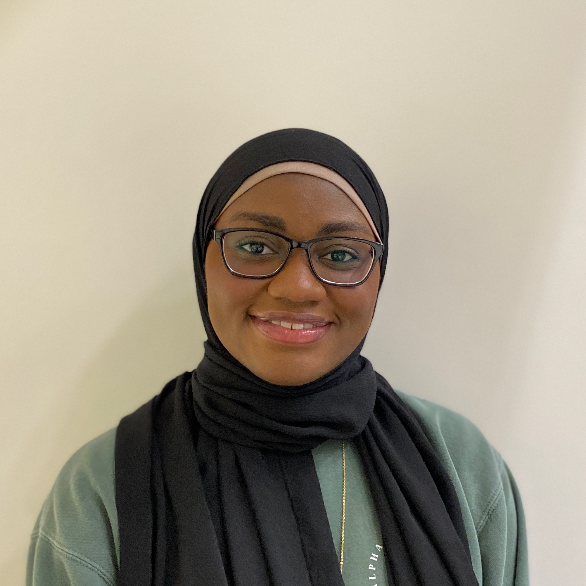

--- 
title: MusQraTT Team
feature_text: |
  ## MusQraTT
  An MQTT Broker in Rust on Composite OS
feature_image: "https://picsum.photos/1300/400?image=989"
---

### Aisha Mohammed

  

    <!-- Picture -->
    

    
    <!--  -->
    

  

  

    <!-- Description -->
    <strong>Description</strong> 
    
Aisha Mohammed is a graduating senior. For MusQraTT, Aisha developed the Rust MQTT-SN Broker. New to the language, there was many difficulties she had to work through to understand the nuances of the language, as well as explore how to take advantage of the benefits the language provides. She has worked in the systems lab for a year and a half, and will be working at MITRE as a Software Engineer.
    

  

### Evan Stella

  

    
  

  

    <!-- Description -->
    <strong>Description</strong>
    
Evan Stella is a graduating senior in CS at GW. Evan developed CompositeOS's support for MusQraTT, including creating a runtime environment for Rust on Composite, adding Rust support for Composite's build system, and optimizing Composite's network drivers for MusQraTT. Evan has worked on CompositeOS for over a year and a half with the GW Systems lab and is excited with the future of the operating system. He will be working as a Research Engineer at Lockheed Martin's Advanced Technology Laboratories after graduation.
    

  

